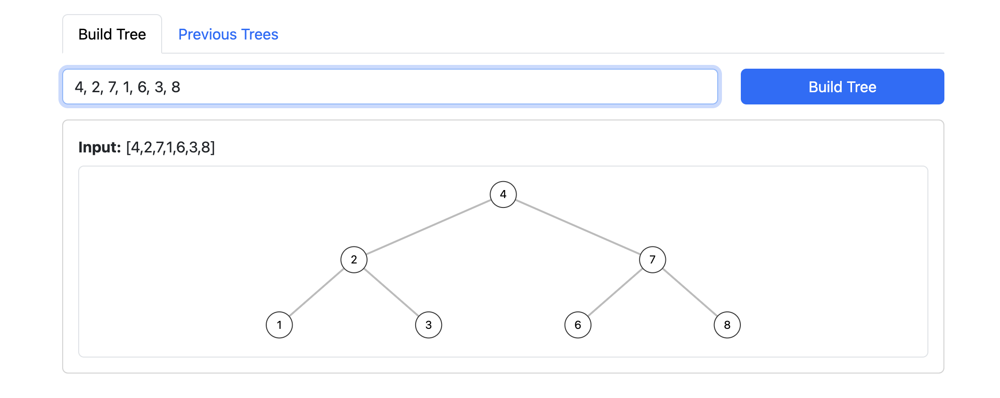
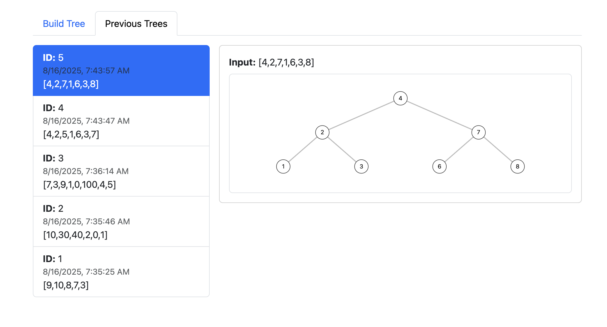

# Binary Search Tree UI

A simple React + Vite frontend for building and visualizing binary search trees.  
This app connects to the Spring Boot backend (`/process-numbers` and `/previous-trees` endpoints) to:

- Build a new binary search tree from a list of integers  
- View previously built trees stored on the backend  

Bootstrap is used for minimal, responsive formatting.  

---

## Features

- **Build Tree Page**: Enter integers separated by commas or spaces, generate a BST, and preview it.  
- **Previous Trees Page**: Browse and select from previously built trees and view their structures.  
- **Interactive Tree Viewer**: Trees are rendered as simple, responsive SVG diagrams.  

---

## Screenshots

### Build Tree Page


### Previous Trees Page


---

## Getting Started

### Prerequisites
- Node.js (v18 or later recommended)  
- npm or yarn  

### Installation
```bash
git clone https://github.com/Keyin-DSA/BinarySearchTree-UI.git
cd BinarySearchTree-UI
npm install
npm run dev
```
Open your browser at http://localhost:5173.
